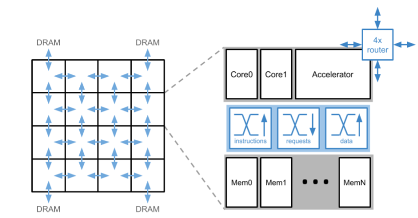

# Loki accelerator template (LAT) interface

A driver for the experimental machine learning accelerator built into the `accelerator` branch of [lokisim](https://github.com/ucam-comparch-loki/lokisim/tree/accelerator).

By default, this library assumes that Loki has been configured with two cores and one accelerator on each tile. The configuration of the accelerator itself, however, should not matter.



## Prerequisites

Requires [libloki](https://github.com/ucam-comparch-loki/libloki).

## Build

Requires Loki compiler.

```
LIBLOKI_DIR=path/to/libloki make
```
